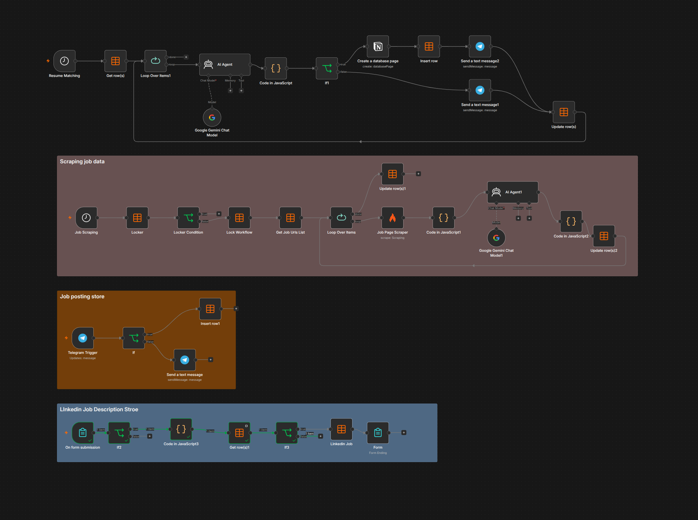
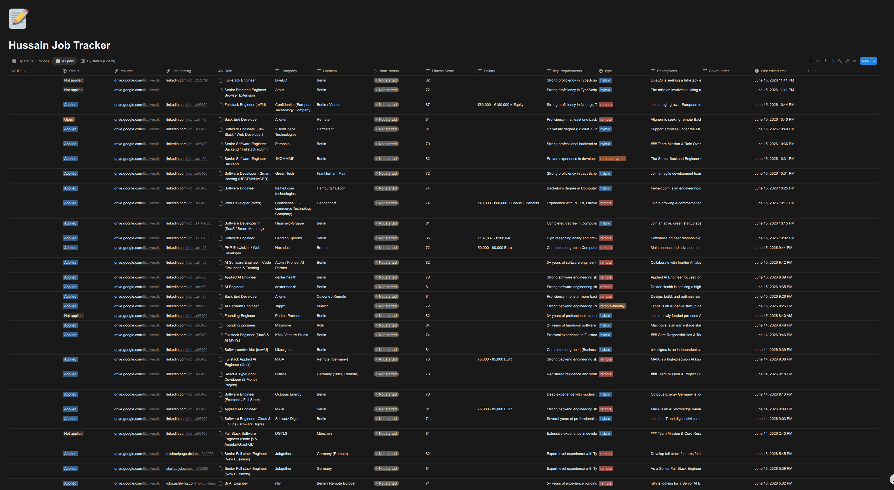

# AI Job Hunter

AI Job Hunter is an AI-powered job discovery, analysis, scoring, and resume tailoring platform built with n8n.

The system automates the entire early-stage job application process:

1. Collect job opportunities.
2. Extract and clean job descriptions.
3. Analyze requirements using AI.
4. Score jobs against a resume.
5. Filter low-quality opportunities.
6. Generate ATS-optimized resumes.
7. Store results and notify the user.

The goal is simple: spend less time managing job applications and more time applying to the right opportunities.

---

# Features

## Job Collection

- Submit job URLs through Telegram
- Submit LinkedIn jobs through a web form
- Store jobs in a processing queue
- Automatic duplicate detection
- URL normalization

## Job Scraping

- Automated job scraping with Firecrawl
- Content cleanup and normalization
- Removes:
  - Navigation menus
  - Tracking parameters
  - SVG data
  - Base64 images
  - Website clutter

## AI Job Analysis

Using Gemini AI, the system extracts:

- Company
- Role
- Location
- Employment type
- Salary information
- Posting date
- Key requirements
- Job summary

## Resume Matching

The system evaluates jobs against a software engineering resume and calculates:

- Skills alignment
- Experience alignment
- Framework alignment
- Language requirements
- Location requirements
- ATS compatibility

Output:

- Resume match score
- Missing skills
- Strengths
- Recommendation

## Opportunity Filtering

Jobs are automatically filtered based on:

- Match score threshold
- Job age
- Quality checks

Only high-quality opportunities move forward.

## ATS Resume Tailoring

For qualified jobs, the system:

- Retrieves the job description
- Compares it with the resume
- Reorders and optimizes keywords
- Improves ATS compatibility
- Maintains factual accuracy
- Generates a tailored JSON resume

## Storage & Tracking

### Notion

Stores:

- Company
- Role
- Job URL
- Score
- Requirements
- Status
- Tailored resume link

### Google Drive

Stores:

- Generated resumes
- ATS-optimized resume files

### Data Tables

Used for:

- Queue management
- Workflow locking
- Job processing
- Status tracking

## Notifications

Telegram notifications for:

- New qualified jobs
- Rejected jobs
- Resume generation completion
- Workflow events

---

# Architecture

```text
Job Source
    │
    ▼
Job Queue
    │
    ▼
Firecrawl Scraper
    │
    ▼
Content Cleanup
    │
    ▼
Gemini AI Analysis
    │
    ▼
Resume Matching Engine
    │
    ▼
Score Calculation
    │
    ▼
Notion Database
    │
    ├─────────────► Telegram Notification
    │
    ▼
Resume Tailor Workflow
    │
    ▼
OpenAI Optimization
    │
    ▼
Google Drive
    │
    ▼
Notion Resume Link
    │
    ▼
Telegram Notification
```

---

# Workflow Modules

## 1. Job Collection

Responsible for:

- Receiving job URLs
- Cleaning URLs
- Duplicate checking
- Queue insertion

## 2. Job Scraping

Responsible for:

- Scraping job content
- Removing noise
- Preparing AI-friendly content

## 3. Job Analysis

Responsible for:

- Extracting structured data
- Identifying requirements
- Detecting technologies
- Calculating scores

## 4. Resume Matching

Responsible for:

- ATS-style evaluation
- Candidate-job comparison
- Fit score generation

## 5. Resume Tailoring

Responsible for:

- Resume optimization
- Keyword alignment
- ATS improvements
- Resume generation

---

# Tech Stack

## Automation

- n8n

## AI Models

- Google Gemini
- OpenAI GPT

## Web Scraping

- Firecrawl

## Databases

- n8n Data Tables
- Notion

## Storage

- Google Drive

## Notifications

- Telegram Bot API

## Integrations

- Notion API
- Google Drive API
- Telegram API
- Gemini API
- OpenAI API
- Firecrawl API

---

# Key Engineering Challenges

## Duplicate Detection

LinkedIn URLs contain tracking parameters.

The system normalizes URLs before storage:

```text
https://linkedin.com/jobs/view/12345/?tracking=abc
```

becomes

```text
https://linkedin.com/jobs/view/12345
```

This prevents duplicate records.

---

## Workflow Locking

A lock table prevents concurrent executions.

Benefits:

- No duplicate processing
- No race conditions
- No overlapping runs

---

## Queue-Based Processing

Jobs are processed asynchronously.

Benefits:

- Better reliability
- Easier recovery
- Improved scalability

---

## Content Cleanup

Before sending data to AI:

- SVG data removed
- Images removed
- Tracking information removed
- HTML noise removed

This significantly reduces token usage and improves extraction quality.

---

## ATS Optimization

The Resume Tailor workflow:

- Preserves truthfulness
- Improves keyword matching
- Reorders priorities
- Increases ATS compatibility

without fabricating experience.

---

# Example Output

## Job Analysis

```json
{
  "company": "Example Company",
  "role": "Full Stack Engineer",
  "location": "Berlin",
  "type": "Remote",
  "resume_matching": 82,
  "key_requirements": [
    "TypeScript",
    "Node.js",
    "PostgreSQL",
    "Docker"
  ]
}
```

## Resume Output

```json
{
  "name": "Hussain Hedayati",
  "title": "Software Engineer",
  "skills": [
    "TypeScript",
    "Node.js",
    "Next.js",
    "PostgreSQL"
  ]
}
```

---

# Screenshots

## Workflow



## Job Database



## Resume Matching


## Tailored Resume


---

# Future Improvements

- Next.js dashboard
- Multi-user support
- Chrome extension
- LinkedIn integration
- AI cover letter generation
- Interview preparation assistant
- Job recommendation engine
- Analytics dashboard
- PDF resume generation
- Email application support

---

# Repository Structure

```text
.
├── workflows/
│   ├── Job Scoring.json
│   └── Resume Tailor.json
│
├── screenshots/
│   ├── workflow.png
│   ├── notion-database.png
│   ├── resume-matching.png
│   └── tailored-resume.png
│
├── README.md
└── .env.example
```

---

# Setup

1. Install n8n.
2. Import the workflows.
3. Configure credentials:
   - OpenAI
   - Gemini
   - Firecrawl
   - Telegram
   - Notion
   - Google Drive
4. Create required Data Tables.
5. Configure environment variables.
6. Activate workflows.

---

# Author

## Hussain Hedayati

Software Engineer

Portfolio: https://hedayat.me

GitHub: https://github.com/Hussain1488

LinkedIn: https://www.linkedin.com/in/hedayati1488/

---

# GitHub Repository

https://github.com/Hussain1488/job-scoring

---

If you find this project useful, feel free to star the repository and share feedback.
